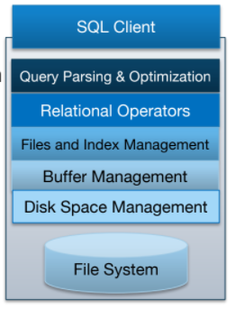
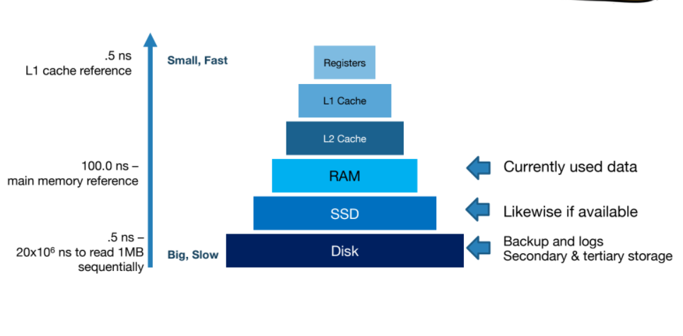
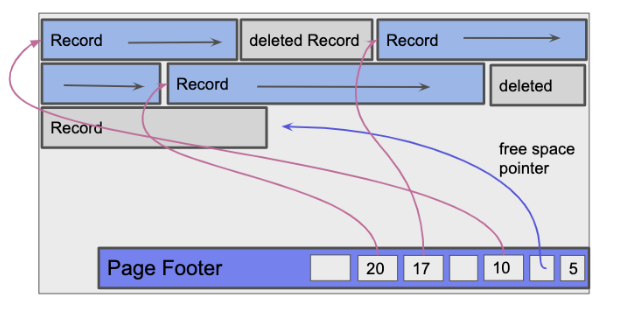
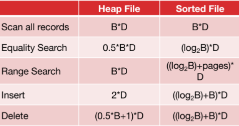

# Memory and Disks 
## Database Architecture 
  

# Memory Hirarchy 
 

## Two Types of Disks 
- ### Hard Drive Disk 
- ### Solid State Disk 

## Block Level Storage
- Read and write large chunks of data sequnetially. 
- maximize use of data 
    - cach popularly used data in memory.
    - pre-fetch data likely to be accessd data. 
    - Buffer write to sequential blocks.
- Block is a unit of transfer data between disk and memory.
- page when in RAM. Block when in disk. 

## Disk Space Management 
- manage space on Disks, map pages to locations on disk. 
- load pages from disk to memory. 
- save pages again to disk.
- read/write, allocate/deakkocate logical pages. 
- mplementation 
    -  talk to storage devise directly.
    - run our own over file system

# Memory Vs Disks 
 - whenever a database process data is must be stored in memory. accessing data from memory is fast. 
 - Large data can not be fit in memory, disks used to cheaply stroe data. but with large cost when read or write. 

## Files, Pages, Records 
- the basic unit of data in relational database is a **record(row)**, records organized into **relations(tables)**. 
- the basic unit of storage for disk is a **page**, smallest unit of transfer data between disk and memory. 
- to store it on disk each relation is stored in a file, and each record organized in a pages in the file. 
- database determine type of file, how pages are organized in this file, how records organized into each page, format of record.  

## Types of Files 
- database descide which based on I/O cost of the relation accses pattern. 1 page write/read disk.
## Heap files:  
- ## Linked list Implementation
    - every data page contains records, pointers to next and previous page, free space tracker. 
    - Header page act as a header for the linked list. sperate the data pages int two linked list. full pages and free pages. 
    - when space is not enough, a new page is allocated, and append to the free portion, when page become full moves to full pages. 
     
- ## Page Dictionary implementation
    - Linked list for header page, each header point to the header page, it's entries contain pointers to data page and the amount of free data.
    - page directory is faster than linked list, but it is more complex to implement. 
    

## Sorted Files: 
- sorted files pages are ordered and records ordered by keys.
- searching is O(Log(n)) n = num of pages
- heap organization faster than sorted in insersion, sorted faster in search. 

## Records Types: 
- Fixed Length: contain fixed length fields(Integer, boolean, date), each record conatains same num of bytes. 
- Variable Length: contain variabl/fixed length fields, each record conatains different num of bytes. fixed stored first then variables, with record header points to the end of the variable length field.  
- every record identified by a unique **record id(rid)**. 

## Page Format: 
- ## Pages with fixed Length records. 
    - use page header storing num of records currently on the page. 
    - when there is no gapes between pages the, when insert calculate the next position using num of records and it's size. 
    - when there is gap the header page stares a additional bitmap indicates which slots are open to taken. when insert find the first slot and insert the record, set the bit to filled.  

- ## Pages with variables length records. 
    - each page uses page footer maintains the slot directory tracking slot count, a free space pointer, entries.    
    - slot count track the number of slots in the page, filled and empty. free space pointer points to the next free position whithin the page, each entry contain [record pointer, record length]. 
    - when delete, find record entry setting [RP, RL] to null. 
    - when insert, find first free slot, set  entery [RP, RL] to the record. when there is no null create new entry. 

 
  

## Cost Model   
- Analysis of the cost of different operations in a database. 
- it depends on 
    - B: number of blocks in the database.   
    - R: number of records in the Block. 
    - D: average time for R/W disk block.

# Indexing
- looking up things by values.
> “If you don't find it in the index, look very carefully through the entire catalog. 
- Indexing Data Structure 
    - Search Trees(AVL, B+ Tree, Red Black Tree, 2-3 Tree) 
    - Hash Table 

## Index 
- index is a data structure that enables quick **lookup(equality)** and **modification(insert, delete)** of **data entries(items stored in index)** by search **key(subset of columns)**.   
- **Types** B+ trees, B- trees, Hash Tables, GIST.

