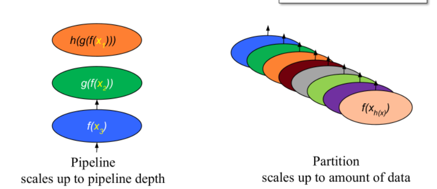
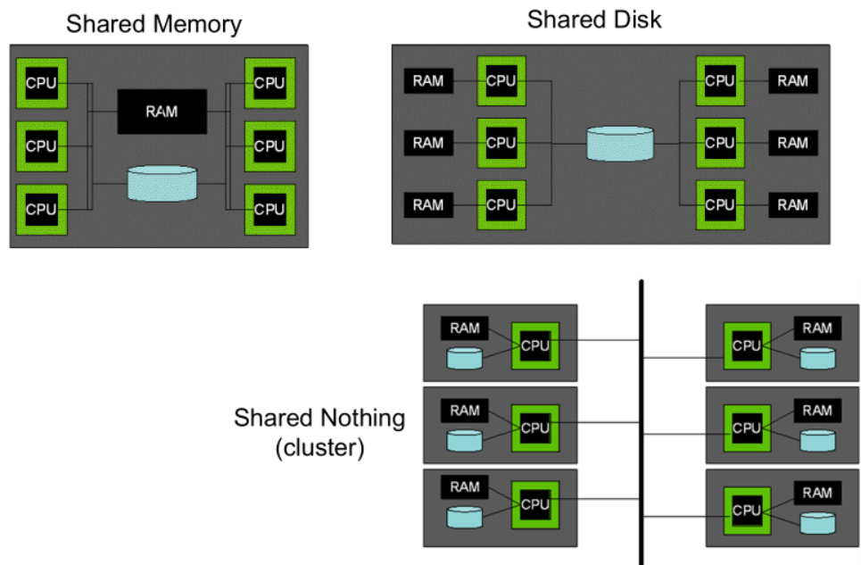
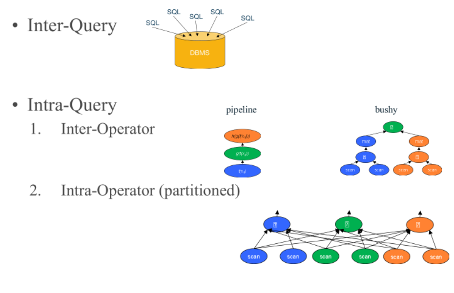
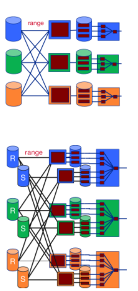

# iterators and joins 

## Relational operators and Query plans  
- relational algebra expressions is a query plan in form of a tree, edges represents flow of tuples from one node to another, nodes are relational ops. 
- every input to a relational op is a relation, and every output is a relation, called **data flow graph**. 
- query optimizer selects operators to run, query exuter runs this operators by creating instances of operators. 
- each operator instance implements iterator interface to excute operator logic and forwording tiples to the next operator.


## Iterators interface 
- setup -> configuring the input args 
- init -> setup the operator state 
- next -> iterate over the input tuples and return output tuple 
- close -> clean up the operator state. 
- init and next can result in streaming(on-the-fly), or blocking(batch) alogrithm for iterator. 
- **streaming** constant amount of work for every call 
- **blocking** does not return until all the work is done consume its entire input.  
- iterator maintain a private state. 

### Select operator iterator
```ruby 
def init(predicate) 
    child.init() 
    pred = predicate 
    curr = null 
end 
def  next() 
    while (curr != EOF && !pred(curr)) 
        curr = child.next()
    end   
    return curr 
end 

def close() 
    child.close() 
end 
```

### Heap scan operator iterator 
```ruby  
    def init(relation) 
        heap = relation.get_heap() 
        curr_page = heap.get_first_page()
        curr_slot = curr_page.get_first_slot()
    end 

    def next() 
        return EOF if curr_page == null  
        curr = [curr_page, curr_slot] 
        curr_slot = curr_page.get_next_slot() 
        if(curr_slot == null) 
            curr_page = curr_page.get_next_page() 
            if(curr_page == null) return EOF 
            curr_slot = curr_page.get_first_slot() 
        end 
        return curr
    end 

    def close() 
        heap.close() 
    end
``` 

### Sort Iterator 
```ruby 
    def init(keys) 
        child.init()
        run = [] 
        for child in childs 
            ren << child.sort(keys)
        end
        load into buffer
    end 

    def next() 
        output = run.min 
        if runn of min is empty?
            fetch next page from disk to buffer 
        end 
        return output
    end

    def close()  
        deallocate runs files
        child.close() 
    end
```

### Group by Iterator 
```ruby 
def init(keys, aggs) 
    child.init() 
    curr_group = null 
end

def next() 
    until result    
        result = null 
        tup = child.next()
        if(group(tup) != curr_group) 
            if(curr_group != null) 
                result = [curr_group, final().all]  
            end
            curr_group = group(tup)
            init()
        end 
        merge(tup)
    end 
    return result
end 

def close() 
    child.close() 
end     
```


## Join Algorithms
# R, S
### Nested loop join 
- for each record r in R 
    - for each record s in S 
        - if join condition(r, s) 
            - add(r, s) to buffer 

- **cost**: number of records in R + [number of records in R * number of records in S] 
- scan R once + scan S once per R tuples
- joins order matters. 


### page nested loop join
- for each rpage in R  
    - for each spage in S 
        - for each rrecord in R 
            - for each srecord in S 
                - if join condition(rrecord, srecord) 
                    - add(rrecord, srecord) to buffer 

- scan R once and and scan S per page of R
- better than nested loop join, but still not optimal. 

### Block nested loop join
 - scan R once + scan S as many times as there are blocks in R


### Index nested loop join 
- optimizer selects index join if it is found an index on both relations.
- when we have index on S that is on the appropriate key, we can use index nested loop join. 
- for each record r in R 
    - for each record s in S 
        - if join condition(ri, si) 
            - add(r, s) to buffer   

### Sort merge join
- requires equality predicate on both relations. 
**Algorithm**: 
- sort R and S by join conidtion, all equals key are consecutive. 
**Cost**: 
- sort then join -> sort R + sort S + [R]+[S] 
- we can do refinement of sort merge join by combining last pass of merge-sort and join pass.
```ruby 
do  
    if(!mark) 
        while(s > r) { advance r} 
        while(r > s) { advance s} 
        mark = s 
    end  

    if(s == r) 
        result = [r, s] 
        advance s
        return result
    else 
        reset to mark 
        advance r
        mark = null
    end
end 
```


## Hash join
- ### Two passes  
    - ### Partitioning 
        - partition tuples fromm R and S by join key and store them in scratch disk. 
    
    - ### Build & Probe 
        - build hash table on R and probe hash table on S. 


### Cost
Partitioning phase: read+write both relations
⇒ 2([R]+[S]) I/Os
• Matching phase: read both relations, forward output
⇒ [R]+[S]
• Total cost of 2-pass hash join = 3([R]+[S])
• 3 * (1000 + 500) = 4500 


# Parallel Query Processing 

## parallelism
- parallelism is all about I/O bandwidth, it's all about how much data throught the pipes of your systems at once. 
- scan 1 tera-byte is a big deal! you can take a big problem and break it down into smaller pieces. each piece can be processed in parallel. each piece is independent of each other.  
- ### two metrics 
    - speed-up when adding more hardware.
    - scale-up when adding more hardware and size of data grows up.

- ### kinds of parallelism
    - **Pipelining** multible stages of nested functions(operators) runs in parallel. operator run produce output and pass it to the next operator to run upon it in parallel.
    - **Partitioning** partitions data across multiple machines, each machine can run the query at the same time. partioning and parallelism scales up to the amount of data.

 

## Parallel Architectures

### Shared Memory 
- typical to regular cpomputers 
### Shared Disk 
- sperate cpu and memory sharing the same disk.
### Shared Nothing
- each node has its own memory and cpu and disk that are connected by network.  
- shared nothing is the most common,scales with data, does't rely on hardware.



## Query Parallelism
### Inter-Query 
- parallelism across queries. multiple queries can run in parallel on a seprate processor, single thread per query. 
- require parallel aware concurrency control when doing updates on disk.
### Intra-Query
- **Inter-operator-pipelining**parallelism within a query. multiple queries can runs in parallel within the same query.
- **Inter-operator-pushy** parallelism within a query, query divdied int multible parts and doing it's computation materialized the output of part and jpin the all parts together. 
- **Intra-operator** divide the query on multiple machines and run it on each machine in parallel. 

 


## Data Partitioning
partitioning is the process of dividing data into multiple parts and distributing them to multiple machines.
### Round Robin


## Parallel Query

### parallel Scan 
- sacn in parallel find matches on every machine, concat the result when it is done merge it on some machine.
- if the partitioning is on the slection key we can skip entire machine that does not have the key.
- index can be built at each partitioning.
- lookup by Key 
    - if partioning on the key go to the relevent node 
    - else brodcast lookup to all nodes 
- insert 
    - if partitioning on the key go to the relevent node and insert 
    - else insert anywhere
- insert unique key 
    - if partitioning on the key go to the relevent node and reject if already exist. 
    - else brodcast lookup check if not exist insert else reject. 


## parallel hashing 
Phase 1: shuffle data across machines (hn)

- streaming out to network as it is scanned
which machine for this record?
use (yet another) independent hash function hn

- Receivers proceed with phase 1 in a pipeline
as data streams in from local disk
and network 

## Pallel hash join
- Phase 1: shuffle data across machines (hn) 
- Pass 2 is local Grace Hash Join per node


## Parallel Sort  
- Phase 1: shuffle data across machines on specific ranges
- Phase 2: sort data on each machine 

## parallel Sort Merge Join 
- Phase 1: shuffle data across machines on specific ranges. 
- Phase 2: sort data on each machine.
- merge join partitions locally on each machine. 
 


## Parallel Aggregation
- Hierarchical Aggregation
- for each aggregate function we need global and local ggregation.**Sum(Sum(x))**


## Symmetric Hash join 
 


## Brodcast join 
- if one of two relations is small, we can broadcat it to all nodes that have a partition of S. 
- do local join on each node and union the result. 

## Parallel DBMS Summary

- ## Parallelism natural to query processing:
- Both pipeline and partition
- ## Shared-Nothing vs. Shared-Mem vs. Shared Disk
- Shared-mem easiest SW, costliest HW.
- Doesn’t scale.
- Shared-nothing cheap, scales well, harder to implement.
- Shared disk a middle ground
- Introduces icky stuff related to concurrency control
- ## Intra-op, Inter-op, & Inter-query parallelism all possible.

- ## Data layout choices important!
- ## Most DB operations can be done partition-parallel
- Sort.
- Sort-merge join, hash-join.
- ## Complex plans.
- Allow for pipeline-parallelism, but sorts, hashes block
- the pipeline.
- Partition parallelism achieved via bushy trees.
- ## Transactions actually pretty easy
- distributed deadlock detection
- two-phase commit
- ## 2PC not great for availability, latency
- single failure stalls the whole system
- transaction commit waits for the slowest worker