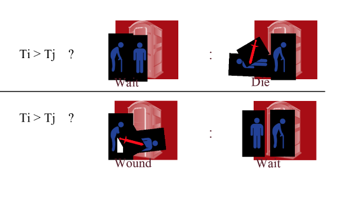
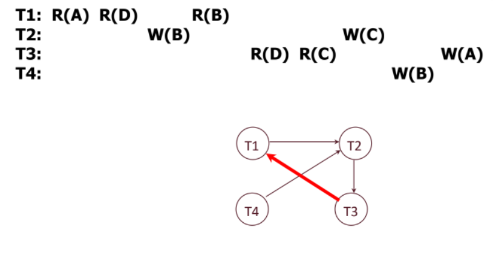

# Transactions and Concurrency
untill now we have seen seen how to deal with single query of database systems. but what if we want to execute multiple queries in a single time? and insure effeciency and relibility and avoid failures. thats where transaction manager comes in.

transaction manager has two subcomponents: 
- lock manager: handle concurrency control issues.
- Logging and Recovery: responsible for fault tolerance and recovery.

any application that needs any information from the database composed of multiple sql query generated by user behaviour, and maybe there many user trying to access the database at the same time. database has to handle those multible users and be correct.

## Concurrency Control 
- insure correct and fast data access in presnce of concurrent work by many user. 
- gives the user illusion of working in order.

## Recovery  
- ensuring fault tolerance and recovery database must have way to deals with bugs, errors, power, media failures. 
- storage gurantese of mission critical data. 

programmer doesn't have to worry about power, media failures, bugs, errors. it's all handled by the database.


## advantages of concurrent execution 
- throughput: num of quries per second maximixe with multicore proccessors. 
- Latency: responce time per transaction. 
    - multible queries are executed in parallel instead of waiting for other quireis to be excuted.
    - one query latency need to be not dependent on the other queries.
    - lightweight queries are not bottellnecked on more time-consuming quires. 


## Problems with concurrent execution 
- **incosistent read**: if user update one table and then update other table. ruser2 access table which not updated yet then table 1 which is updated. 
- **Lost Updates**: two users trying to update the same table user one finishs update before user2. then user2 update done it will overwrite the changes of user 1 and be losted.
- **Dirty Read**: user reads updates that was never committed. user 1 update not completed and aborted by the dbms. user 2 reads the data before roll back.


## Transactions 
a sequnce of multible actions read/write that to be excuted as an atomic unit. either all actions are executed or none of them are executed.
e.g transfer money from one account to another. 
reading account 
updateing account 
writing to account

in SQL
- begin transaction
- execute queries
- commit transaction

Transaction is an abstract view of an application program(activity). a sequence of read and writes of database objects. 
batch of work that be commited or aboted. 
progarm logic is invisible to the database. all it sees is the read/write ops.

# ACID


## Atomicity
- all or nothing property, all the actions should be occure or none of them should be. 

## Consistency
- if the DB starts out consistent, its ends up consistent.  
- consistency id defined by the DBMS integrity constraints.


## Isolation
- excution of each transaction is isolated from other transactions.
- dbms **interleave** actions of many transactions. and ensures that two transactions are not **interfere**.
- final result must be idntical of the result of serial execution.
## Durability
- if transaction is commited, its state is persisted. 

A transaction ends in one of two ways: 
- commit: all the actions are executed. changes needs to be reflected in the database.
-  abort: system crash while Txn is running. no changes are made to the database. 

- Two key properties for a transaction
    - Atomicity: Either execute all its actions (committed), or none of them (aborted)
    - Durability: The effects of a committed txn must survive failures.
- DBMS typically ensures the above by logging all actions:
    - Undo the actions of aborted/failed transactions.
    - Redo actions of committed transactions not yet propagated to disk when system crashes


## Concurrency Control

#### Transaction schedule 
- a sequence of actions on data from one or more transactions. 
- serial schedule: each transaction run from start to end without interfering with other transactions.
- serilaizable: if involves the same Txn, each Txn ordered the same, leave the db at in the same final state.  

## conflicting operations
1. The operations are from different transactions
2. Both operations operate on the same resource
3. At least one operation is a write. 


## locking
locking ensures isolation. it ensures that dbms is able to interleave transactions while guaranteeing isolation. 

locking is what allow transaction to read or write to the same resource. transaction that read data from resource**A**, need to ensure that the data in **A** is not changed by other transaction.  

So a transaction that wants to read data will ask for a Shared (S) lock on the appropriate resource, and a transaction that wants to write data will ask for an Exclusive (X) lock on the appropriate resource.  

only one transaction can have a (X) lock on a resource. but many transactions can have a (S) lock on a resource.

## Two Phase Locking
Transactions must obtain a S (shared) lock before reading, and an X (exclusive) lock beforewriting.

Transactions  cannot  get  new  locks  after  releasing  any  locks  –  this  is  the  key  to  enforcing serializability through locking! 

### Strict two phase locking 
- ensure that all locks are released together when a transaction is completed, preventing cascading aborts.


## Lock Manager
- granted set: names of resources beaing locked. the transcaction that has the lock on the resource.
- mode: locke type.
- wait queue: list of requests that are waiting for the lock that conflict with the locks that have already been granted.


When a lock request arrives, the Lock Manager checks if any Xact in the Granted Set or in theWait Queue want a conflicting lock.  If so, the requester gets put into the Wait Queue.  If not, thenthe requester is granted the lock and put into the Granted Set.

In addition, Xacts can request a lock upgrade:  this is when a Xact with shared lock can request toupgrade to exclusive.  The Lock Manager will add this upgrade request at the front of the queue.
 


## Deadlock

We now have a lock manager that will put requesters into the Wait Queue if there are conflicting locks.  But what happens if T1 and T2 both holdSlocks on a resource and they both try upgradetoX? T1 will wait for T2 to release the S lock so that it can get an Xlock while T2 will wait for T1 to release theSit can get an Xlock.  

At this point, neither transaction will be able to get the Xlock because they’re waiting on each other!  This is called adeadlock, a cycle of Xacts waitingfor locks to be released by each other.

### Deadlock avoidance
assign a priority to each transaction by age now - start time. if Ti want an lock that Tj have, there will be two options: 

```ruby 
Ti > Tj ? Ti waits for Tj : Tj aborts 
Ti > Tj ? Ti aborts : Tj waits for Ti 
``` 
 

### Deadlock detection 

We caninstead try detecting deadlocks and then if we find a deadlock, we abort one of the transactions inthe deadlock so the other transactions can continue. 

- edge from Ti to Tj is a deadlock if Ti and Tj have a conflict lock on the same resource. 
- in figure T1 try to a lock on B. when T2 have conflicting lock on B.
