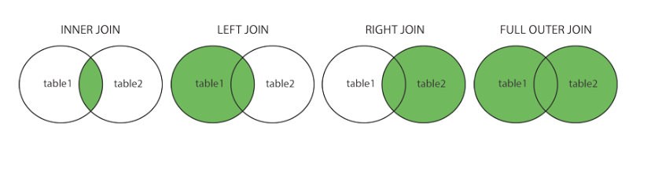

# Week 1  

# DataBase 
- relations is tables, rows are records/tuples, columns are attributes/fields, cardinality is the number of rows.
- SQL is a language for querying databases 
- sechema is the description of the data "metadata" 
- instance is a set of data satisfying the schema
- tables is physical data independence.The logical definition of the data remains
unchanged, even when we make changes to the
actual implementation 


## SQL 
 - SQL is Declarative, say what you want to do, not how to do it. 
 - two types of SQL: 
    - DDL: Data Definition Language, create tables, alter tables, drop tables, etc. 
    - DML: Data Manipulation Language, insert, update, delete, etc. 
- RDMS: is responsible for choose the algorthim to implement the SQL. 

## DDL SQL 
- **Primary key:** unique identifier for each record.
    - provide a unique lookup key for each record. 
    - can not have any duplicates. 
    - can be mad of multiple columns.
- **Foreign Key:** reference to another table.  
    - it point to a primary key of the referenced table. 
    - does not need to have the same name as the revernced key.

## Querying language 
  - ## Querying table 
    - From tells what table to query, where tells what the condition to query on and which specific rows to return, select what columns to return. 
    - the order of returned rows is nondeterministic. unless you specify an order by clause. 
 - ## Null Values 
    - Null represents a value that is unknown or missing. 
    - any operation with null is null  
    - x = null , x > 3, x = 1, x + 4 all evaluate to null. 
    - null is falsy, so where is null just Like where is false. 
    - null is short circuited with boolean operators. 
 

## Grouping and Aggregation  
- ## Aggregation
    - the input to aggegate fuction is the name of the column, and the output is a single value that is the result of the aggregation. 
    - every aggregate func ignores nulls, except for count(*) which return the overall count of rows. 
 - ## Grpuping  
    - the Group By clause is used to group the rows of a query into groups. and then summenrize each group separately. 
    - the group by  must specified usin Having clause. 
    - the having is similiar to where clause, but it's occur after grouping.  
    - the query bellow excuted as follow 
        - 1- specify the from table person  
        - 2- remove the rows with age < 18 
        - 3- group by age, categorize with groups of the same values. 
        - 4- apply the having clause to remove the groups that don't meet the condition. 
        - 5- every group is collapsed to a single row, returning the specified columns in the select clause, two clouumns one age of the group and average num_dog of the group.  
        - ```sql 
            select age, AVG(num_dogs) 
            from person 
            where age >= 18 
            group by age 
            having count(*) > 1 

    - **if you are going to use grouping or aggregate you must select the only grouped/aggergeated columns**. this is will not work one entire cloumn and one row.  
    - ``` sql 
        select age, avg(num) 
        from person 

        select age, num 
        form person 
        group by age
  
## Order By and Limit 
- by default the order by default is ascending, if you want to sort in descending order you must specify the order by desc.
- the limit clause is used to limit the number of rows returned. 
```sql 
    select name, age
    from person 
    order by age desc, age 
    limit 2
```


## Querying multiple tables  
 - ## Slef join  
    - the self join is a join that is performed on the same table, you can use table aliase join on itself.
    - ```sql 
        SELECT x.sname AS sname1,
            x.age AS age1,
            y.sname AS sname2,
            y.age AS age2
            FROM Sailors AS x, Sailors AS y
            WHERE x.age > y.age 
        );
 - ## Cross join 
    - the simplest way to join two tables is to use a cross join. also known as cross product.  
    - it's the result of combining every row from the left table with every row from the right table. 
    - ```sql 
        select * 
        form student, course   
        where num = c_num
    - the cross product often contains information that is not useful. it's often used to generate a massive amount of data.  
    - you can use the **where** clause to filter the rows that are returned. 

    -  
 - ## Inner Join 
    - the inner join allow you to specify the condition in the on clause. 
    - it's the result of combining rows from the left table with rows from the right table that match on a common column. 
    - ```sql 
        select * 
        form student inner join course 
        on num = c_num
    - the inner join is syntatic sugar of cross join with a join condition in the where clause. 
     
- ## Outer Join 
    - **The left outer join** makes sure that every row from the left table is returned, even if there are no matching rows in the right table. 
    - if a row does not match any row from the right table, the row is still included and the row from the right table filled with null. 
    - ```sql 
        select * 
        form student left outer join course 
        on num = c_num 
    - **the right outer join** is the same as left it returned every row from the right table even if there is not matches, and fill rhe row from the left table with null. 
    - ```sql 
        select * 
        form student right outer join course 
        on num = c_num 
    - **full outer join** it guranatee that every row from the each table will apper in the output. 
    -  if a row from either table does not match any row from the other table, it will still show up in the output and the column form the other table will be filled with null. 
    - ```sql 
        select * 
        form student full outer join course 
        on num = c_num
 - ## Natural Join 
    - sql has the natural join which automatically does equijoin on the columns with same name in diffrent tables. 
    - it's the result of combining rows from the left table with rows from the right table that match on a common column. 
    - ```sql 
        select * 
        form student natural join course 
    - not often used in practice because they are confusing.


 - ## join invariants
    - The different types of joins determine what we do with rows that don’t ever match the “join condition”


## Naming Conflicts 
- if there is a naming conflict, which occur when two tables have the same column name, the column name will be prefixed with the table name. 
- we should specify which table cloumn we are referring to. 
- ```sql 
    select * 
    form student, course 
    where student.num = course.num  
- 

## Subqueries
 - subquries are used to filter table in acondition. and outer query is used to filter the result of a subquery. 
 - ```sql 
    select num 
    from enrollment 
    where student >= (select avg(tudents) 
                        from enrollment; 
    ); 
- the subquery is not a table, it's a query.  
    - ## Correlated Subqueries 
        - the subquery can also be correlated with the outer query. 
        - ```sql 
            select *  
            from classes  
            where exists (select * 
                            from enrollment 
                            where classes.num = enrollment.num
            ); 
        - exisit is a set operators that return true if any row returned by the subquery and false otherwise. 
        - any, all, union, intersect, except are also set operators. 
    - ## subquries in the from  
        - let you make temporary table to query from. 
        - ```sql 
            select * 
            from (select num 
                    from classes
            ) as temp 
            where num = 1 
    - One thing to note is that subqueries in the FROM cannot usually be correlated withother tables listed in the FROM. 
    - if you want to reuse temporary tables, you must use the common table expression **with clause**. 
    - if you want to use it in another query use VIEW. 

- **ARGMAX**the argmax is a function that returns the row with the maximum value of the specified column. return multiple rows if there are multiple rows with the same maximum value. 

- **VIEWS**: used as a temporary table, to query from it. used instead of subqueries. 
- used as a subroutine to query from another table.
```sql 
CREATE VIEW Redcount AS
SELECT B.bid, COUNT(*) AS scount
FROM Boats B, Reserves R
WHERE R.bid=B.bid AND B.color=‘red’
GROUP BY B.bid;

SELECT * from Redcount WHERE scount<10;
``` 

- **Common Table Expressions**: used to reuse temporary tables. on the fly 
```sql 
    WITH Redcount(bid, scount) AS
        (SELECT B.bid, COUNT (*)
        FROM Boats B, Reserves R
        WHERE R.bid = B.bid AND B.color = 'red'
        GROUP BY B.bid)

        SELECT * FROM Reds
        WHERE scount < 10
```

## SET 
- A UNION B == A OR B, distinct rows from A or B. 
- A INTERSECT B == A AND B, distinct rows from A and B. 
- A EXCEPT B == A BUT NOT B, distinct rows from A and not B. 


## Multisets 
- can have duplicates values. 
- A UNION ALL B -> sum of cardinality of A and B. 
- A INTERSECT ALL B -> min of cardinality of A and B. 
- A EXCEPT ALL B -> difference of cardinality of A and B. 

 
 

- A UNION B -> perform set operation. 
- A UNION B -> Perform multi-set operation. 

## SQL Flavors 
- **Distinct**: remove duplicate rows before output. 
- **AS**: Alias name. 
- **LIKE** 'B_%' any string that starts with B, B.* any string have B. 
