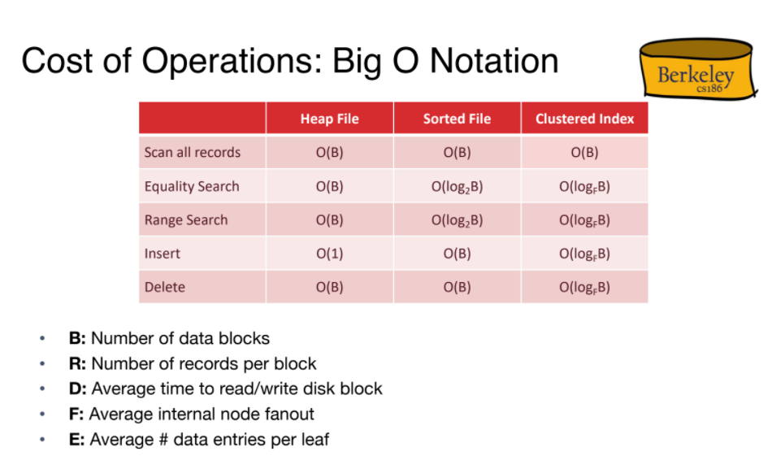

# Indexing and B+ Trees  

# Indexing
- looking up things by values.
> “If you don't find it in the index, look very carefully through the entire catalog. 
- Indexing Data Structure 
    - Search Trees(AVL, B+ Tree, Red Black Tree, 2-3 Tree) 
    - Hash Table 

## Index 
- index is a data structure that enables quick **lookup(equality)** and **modification(insert, delete)** of **data entries(items stored in index)** by search **key(subset of columns)**.   
- **Types** B+ trees, B- trees, Hash Tables, GIST, allow lookups without scanning all data.

## Indexing 
- index is a data structure that allows you speed up reads on a speicific key. it's make queries run faster especially those that are run frequently. 
- index on the user id is a good example of an index. 

## B+ Trees 
- B+ tree have very high **Fan-out**: number of pointers to child nodes in a node. 
- B+ tree is a **self-balancing** tree, grows at root not leaves.
- strores data entries in **leaf nodes** only, thus called B Plus Tree. 
- **Order** is the number of children nodes for internal nodes. it's measure capacity of a nodes.  
- the number of entries for each internal node must satisfy **d < entries < 2d**.  
- Max fan-out is **2d + 1** == num of pointers.  
- Only the leaf nodes contain records (or pointers to records).  Theinner nodes (which are the non-leaf nodes) do not contain the actual records.

 

## Scalling B+ Trees 
- B+ tree allow index Massive number of records.

### Searching B+ Trees
- start at root, do a binary search on the key, find the record in the leafs.
 

## inseting B+ Trees 
- find the correct Leaf.
- put data entry int the leaf. 
    - if leaf have enough space, insert, done!. 
    - else split the leaf into two leafs. (L1, L2)  
        - redistribute the entries evenly, **copy up** middle key and ptr to L2. 
        -  insert index entry pointing to L2 into L.  
            - else recursively split and **push up** from parents.  

### Before Inserting B+ Trees
 

### After Inserting B+ Trees

## Deleting B+ Trees 
- occupency invariants not inforced during deletion. 
- just delete leaf entries and save space for next insertion.  
-  if leaf is completely empty, taht's ok 

## B+ Tree Bulk Loading 
- Build index on Large table from scratch. it will take a long time, search from root and insert leaving half empty Leaves. modify random pages. 
- **Smarter Way** Sort input records by key, fill leaf page by fill factor 3/4. 
-  when parent is full split.  

  

# Summary

- B+ Tree is a powerful dynamic indexing structure
- Inserts/deletes leave tree height-balanced; logFN cost
- High fanout (F) means height rarely more than 3 or 4.
- Higher levels stay in cache, avoiding expensive disk I/O
- Almost always better than maintaining a sorted file.
- Widely used in DBMSs!
- Bulk loading can be much faster than repeated inserts for creating a B+ tree on a large
data set.

# Refinmets on indices 
- issues to consider in any index Structure.
    - Query Support: types of queries that can be performed on an index.  
    - choice of search key 
    - Data Entry Storage. 
    - Variable length keys.
    - Cost of index. 

## Query Support
- Basic Selections: in single dimension 
    - equality 
    - range
- Exotic Selections: in multi-dimension 
    - 2d Box/Circle/Polygon
    - 3d R-tree/K-d Tree 
    - nearest neighbor queries
    - Reqular Expressions, Genome Strings.
    - geo-spatial queries. 

## Search Key and Ordering 
- in an orederd index, the keys is orderd lexicographically. by the search key, order 1st column, if ==, then order 2nd column, and so on.
- Search by rang using Composite Key. 

## Data Entry Storage
- the repersentation of data entry in index, actual data Or Reference to data. 
- Three types of data entry in index: 
    - **Value**: record data stored in the index file. 
    - **Reference**: index contains key and record id<PID, RId>. 
    - **List of Reference**: Key and a list of matching records ids. 
- indexing by reference required to support multible indexes per table.

## Clustered and Non-Clustered Indexes
* ### Clustered Indexes 
    - sort the haep file, leave some space on each block for future inserts. 
    - index entries direct search to data entries.
    - gives fairly sequential access to data in the haep file. 
    - **faster for rang queries.** 
    
    - **Order of data records is “close to”, but not identical to, the sort order.** 
     

## Clustered Indexes vs Non-Clustered Indexes
- ### clustered Pros 
    - efficient for range queries. 
    - potential locality benfits, faster for sequential access and prefetching. 
    - support certain types of comperissions.  
- ### clustered cons 
    - more expensive to maintains, periodically update heap order, resort, reclustered heap file incrementally. 
    - heap file usually only packed 2/3 to accomodate new data, leaving space for future inserting. 

## Variable Length Keys  
- fill factor is the number of bytes.
- compress prefix/suffix of key to save space. 

## B+ tree cost Model  

