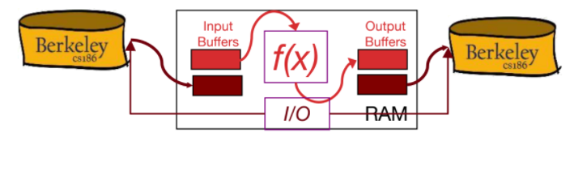
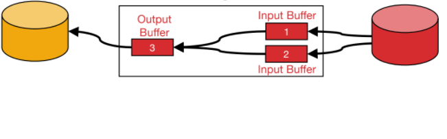
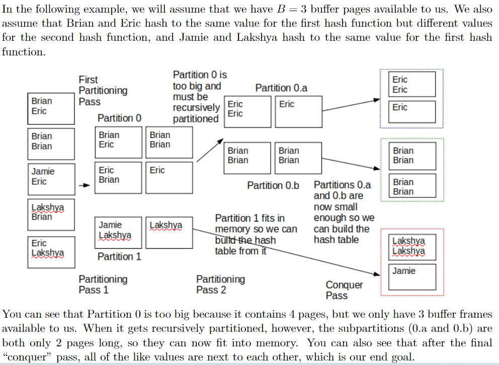
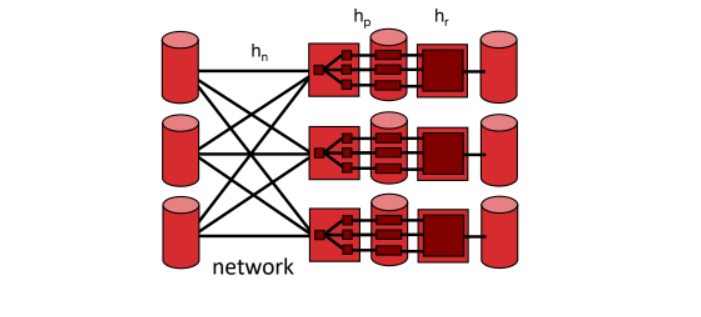
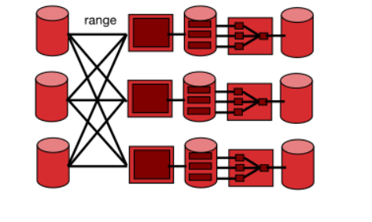

# Sorting and Hashing
9.1, 13.1, 13.3, 13.4.2

## Sorting

### Why sort?
- **Rendezvous**: getting together tupels that need to be proccessed together in memory at the same time. 
    - **Distinct**: remove duplicates, group duplctaes together and keep just ine of them as a representative.
    - **Grouping for suumerizing**: group members of a group together and compute a summary of the group.
    - **Join Algorithms**: merge sort join, need to rendezvous tuples from two different tables and concatenate them.
- **Ordering**: 
    - the user ask to sort the data in a specific order.
    - Bulk Loding the first step in indexing. 

## out-of-core Algorithms
- algorithms that are not in-core(in ram memory).

## Single-pass Algorithms
**Map**
- compute f(x) for each record, write out to the result.
- 

**Approach**:
- read a chunk from input to input buffer.
- write f(x) for each record, compress it in some manner, write to output buffer.
- when the input buffer is empty, read another chunk from input.
- when the output buffer is full, write it to output.

one thread doing I/O and Computation.
## Double Buffer Algorithms
- Two Threads: Main thread run f(x) on one pair I/O buffer, I/O thread drain/fill unused buffers. 
- parallelism: two operations are running at the same time(Overlappin). 
- parallelism: happen on disk, it's a parallel device.
- I/O handling deserve it's own thread, it's a general theme in desining I/O intensive systems like database systems.
- two threads are swapping buffers between them when every thread finish their current task.

## Sorting & Hashing formal specification
- ### Sorting
    - A File F produce an output file Fs with content R stored in order by given criteria. 
- ### Hashing
    - A File F produce an output file Fh with content R arranged on disk that two records that have the same key are stored consecutively, no two same records sperated by a record with differnt hash value.

## I/O 
in Database systems we only care about # of I/O operations. because of how time consuming it is to read and write to disk. when developing an algorithm, we need to think about how much I/O operations it will take and minimize the # of I/O it will incure.

## Sorting 
## Two Way sorting
- pass 0 (conquer a batch) 
    - read a page sort it write to the disk, now having one page size sorted in disk. 
    - only one buffer is used.
    - a repeated "batch job"  

- pass 1,2,3,...(mege via streaming)
    - require 3 buffer pages. 
    - read tow sorted blocks that generated by pass 0, take smallest buffer from input buffer write it in output buffer(merging). 
    - keep doing until Output buffer is full, write it to memory.

**Cost Model**: 
**2N * (1 + (log2 N)) I/Os** 

## General External Merge Sort
- the result of merging two sorted merges called **sorted run**
- tow optimization 
    - **ONE**rather than sort individual pages, load B pages and sort them all at once. 
    - **SECOND** merge more than sorted runs at a time. 
- the conquring phase produce (N/B).ceil sorted runs. 
- during the merging we are dividing number of sorted runs by B-1, so the base of our log is b-1.
- number of pages in each sorted run 0 is B, in pass 1 = B * B-1

## anlayzing the algorithm
- every pass require 2 * N I/O operations. where N is the number of pages, read in every page and write it after modification.
- you always need one pass for the first pass 0. 
- **Passes** 1 + (logb-1 N/B).ceil
- **I/Os** 2N * (1 + (logb-1 N/B).ceil  
- **Minimum num of buffer pages need to to sort N pages in X passes** **N/B(B-1) <= X**

# Hashing 
## External Hashing
sometimes ypu need to group together the same values, and remove duplicates.
in databases grouping together the same values is called **Hashing**. 
we can not doing hashing in memory, we need to do it out-of-core.

## Hashing Algorithm
Because we can not fit all of the data in memory at once we need to build several hash tables and concatenate them together. and we need to guarantee that each value has the same hash value grouped together in memory.

### Divide and Conquer 
- Divide: 
    - partitioning passes, hash each record to B-1 partitions, every partition have similar hash values. 
    - when output buffer is full, write it to disk and insure taht all pages from this partion are adjacents. 
    - if the partition is bigger than B, we partition it again using differnt hash function, we can do that recursively.
- Conquer: 
    - constructing hash tables. 

## Cost of External Hashing
- 4N I/Os 

## Sorting Vs Hashing
- Sorting is conquer and divide, Hashing is divide and conquer. 
- sorting is **4N** I/Os, Hashing is **~4N** I/Os. where N is the number of pages.

## Parallel Hashing 
- **phase 1**: shuffles data across the machines using hash function hn to determines which machine for this record. 
- **phase 2**: recivers procced with phase 1 as a data stream and do external hashing. 

## Parallel Sorting
- **Phase 1**: shuffle data across the machines, split data in ranges every machine has a range od sorted pages. 
- **Phase 2**: recivers procced with phase 1 as a data stream and do external sorting.
- avoid data skewed. 

## Sort vs Hashing
- ## sorting 
    - output is sorted.
    - allow duplicate values.
    - scales linearly with the number of input records. 
    - **Cons**: skewed data
- ## Hashing 
    - output is not sorted.
    - no duplicate values.
    - scales linearly with number of duplicates values.  
    - shuffle eqully across machines.

# Relational Algebra
## Relational Algebra
- parser parse SQL query to relational algebra, relational alegebra can be expressed as tree of operators called**logical query plan**. 
- **logical query plan** is a strategey for excuting query expressed as a tree of operators. 

**SQL** is a declarative language, it is a language that describes the data in a database. 
**Relational Algebra** operational description of a computation.

**DBMS** internally transform SQL query into relational algebra, and then execute the relational algebra expresssion, manupilate and siplify it, and figure out the best mechanism to execute it.

## Relational Algebra Preliminaries
**Closed** results is also a reltion instance.
**Typed** input schema determine the type of the output schema. 
**Set Semantics** no duplicates in a relation instance in contrast of SQl.

## Relational Algebra Operators
- ### Unary Operators single relation  
    - **Projection**: select a subset of columns from a relation.
    - **Selection**: select a subset of records from a relation.
    - **Renaming**: rename the columns of a relation.
    - **Aggregation**: aggregate the values of a relation.
- ### Binary Operators two relations 
    - **Union**: union two relations, same num/type of tuples.
    - **Difference**: difference of two relations.
    - **Cross-Product**: cartesian product of two relations.

- ### compound operators
    - **Theta-Join**: join two relations on a logical expression. 
    - **Equi-Join**: theta join with theta beign a conjuction of equality. 
    - **Natural-Join**: equi-join on all matching columns.