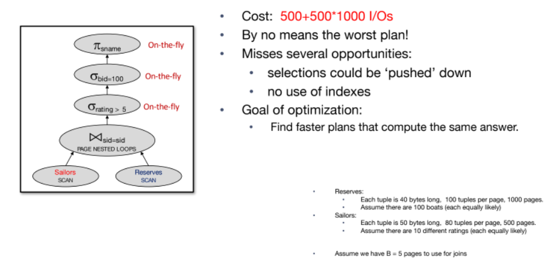
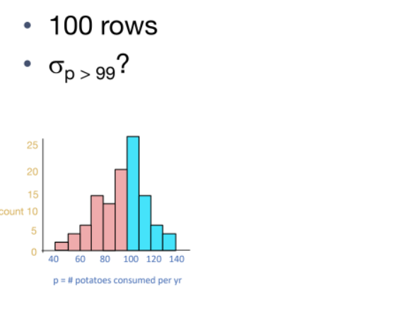
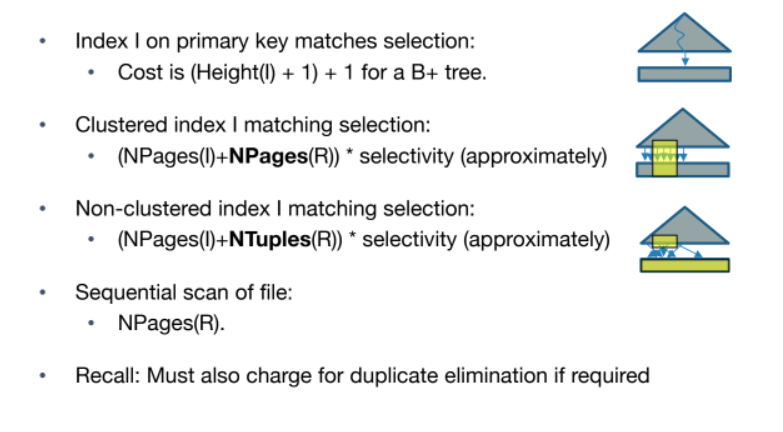

# Query Parsing & Optimization 

## Query optimizer  
- the bridge between a declartive domain specific language **SQL** and custom imparative computer program 
- take Query what you want and descide how to compute this query 
- in terms of today technology this is AI-driven Software Synthis. 
- similiar to AI today try to find the best best result in a large search space Heuristic and Optimization. 
- Research today try to use Deep RL to improve the pruning of QO
- invented long time ago as part of System R.

## Query parsing and Optimization
 

## Query Parser
- parse the query into a synatcs tree structure
- check for correctness of the query
- check of authorization is the user has the right to equery that table.

## Query Rewriter 
- flatten views 
- convert subqueries into joins or to fewer query blocks.
- convert the query into form as simple as posible. 

## Cost based Query Optimizer 
- optimize one query block at a time. 
- use catalog stats to find the least-cost plan per query block.

## Query Optimizer 
- Query block converted into relational algebra 
- relational algebra converted into tree 
- each operatore has implementaion choices e.g joins algorithms. 
- operators can be applied in diffrent orders. 
- ### Component of Query Optimizer 
    - plan space: all possible plans for a query.
    - cost: cost of each plan. 
    - search strategy: how to find the best plan.
- ### Goals 
    - find the the plan with least estimated cost, and try to avoid really bad actual plans.

## Relational Algebra Equivalence
- to rewrite a relational algebra expression into another you need a set of equevilance rules. 
- cascade, commutative. 
- ### Join Ordering 
   

### Common Heuristics 
- ### Selections
    - Apply selection as soon as you have the relevent columns. 
    - select first and join then with smaller input. 
- ### Projections
    - keep only the columns you need to evaluate downstream operators. 
- ### Avoid cross products
    - use theta join when possible avoid cross products.

## Phsical Equivalence
- ### Base table access
    - Heap scan
    - Index scan (if available on referenced columns)
- ### Equijoins
    - Block (Chunk) Nested Loop: simple, exploits extra memory
    - Index Nested Loop: often good if 1 rel small and the other indexed properly
    - Sort-Merge Join: good with small memory, equal-size tables
    - Grace/Hybrid Hash Join: even better than sort with 1 small table
- ### Non-Equijoins
    - Block (Chunk) Nested Loop

## Plan Cost Analysis 

- ### Slection pushdown 
    - push down rating > 5 to left side of join. minimize the cost to the half.  
    - push down bid = 100 to right does not change the cost because it dones on the fly.
    - materialize the right side of the join minimize the cost. 
- ### Join Ordering 
    - move the inner join to the left side of the join minimize the cost if the relation size is smaller.
    - change the ordering and materialize the right side of the join.
- ### Join Algorithms 
    - changing the join algorithm can change the cost.
- ### Projection pushdown 
    - pushing down projection to the left side of the join. 
- ### Indexes 
    - indexs clustered or not.

# Costing and Searching 

## What we need to do Query Optimization? 
given a closed set of operators relatinal operators that takes table in and table out. 
this operators has logical equivilance(cascade, commute) and phsical equivelnce(types of algo). 
### plan space
given this set of operators we have plan space which all the possible query plans that produce the same correct answer. this plans defined by the relationsl equivelence and physical equievelnce.

### Cost Estimation
what is the cost of our operators. and estimation to the size of data that goes into this operators. 
the size of data is based on the catalog info whta is size of the table.

### Search Algorithm
search algorithms that goes through the search space and find the best plan with the least cost. 

## Big Piecture of System R Optimizer 
**plan space** too big plans must be pruned. if many plans have the same **overpriced** subplan ignore them. avoid cross product. consider only the left deep plans.s
- System R consider only the left joins tree because it restrict the plan space allow us to fully piplined the plans intermidiate results not written.

**cost estimation** 
- stats in system catalog used to estimates the size of data and cost. 
- cinsiders compination of I/O and CPU cost.
**search algorithm** 
- System R uses a Dynamic Programming based search algorithm. 
- **Dynamic Programming**: optimization technique for problems with subcomponents. 

## Query Blocks 
- query blocks are the unit of work that the optimizer works on. you want to brak your query into smaller blocks optimizing one block at atime. 
- flatten your queries blocks into single one query block. query rewriter. 

### physical properties 
- output of an operator Sorted, Hash Grouping. 
- opertors that produce properties in certain form(sorted). index, sort, hash grouping. 
- merge join require inputs to be sorted.
- merge join and nested loop join preserves the sort order of inputs. 

## Cost Estimation
- for each plan must estimate the total cost. 
- estimate the cost of each operators depedns on the cardinalities. and size of the result of each operator. it will be input to the next operator.
- in system R the cost is boiled down to **#IO + CPU-factor*#tuples**.

### Statistics and Catalog 
- catalog contains the statistics of the tables. 
- updated periodically.
 

### Selectivity 
- reflects the impact of the query in reducing the number of tuples returned.
- sel = |output| / |input|.
- result of size estimation. 

### Slectivity With Histograms
- the idea is divide the input into buckets of equla values and count the number of tuples in each bucket. 
 

**Selectivity Conjunction**
- multiply of sleectivity of each conjuct.
 

**Selectivity Disjunction**
- sum of sleectivity of each disjunct - multiply of two disjunct.  
- 50% + 46% - (50% × 46%) = 73% 

**Selectivity Not** 
- 1 - sel.

### Join Selectivity
- Simply compute the selectivity of all predicates
- And multiply by the product of the table sizes

## Search Algorithm

### Single table plans
- single table quries includes select, project, and agg. 
- consider each access path file scan, index scan, and sort.
- choose the one with the least cost.
- slection, projection, done on the fly.
- result pipliend into grouping/aggregation. 

### Cost Estimation for Single Table Plans with index 
- clusterd index featch adjacent pages contains index indecies are adjacent. 
- non-clustered index all pages that may be contains index.

## Dynamic Programming

