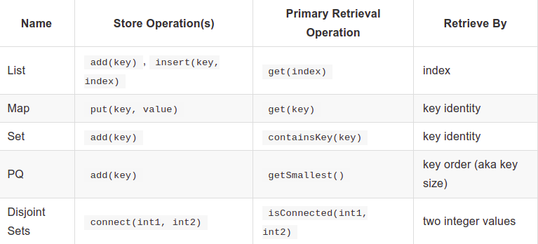
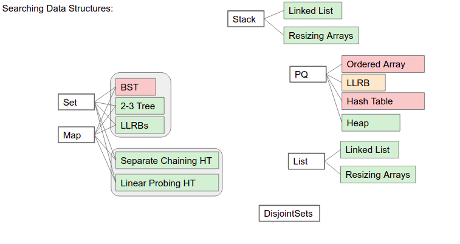

# Heaps and PQs

## Priority Queue Interface

The abstract data type "priority queue" could be used to find the smallest or largest element quickly instead of searching through the whole tree. There can be memory benefits to using this data structure.

```java
/** (Min) Priority Queue: Allowing tracking and removal of 
  * the smallest item in a priority queue. */
public interface MinPQ<Item> {
    /** Adds the item to the priority queue. */
    public void add(Item x);
    /** Returns the smallest item in the priority queue. */
    public Item getSmallest();
    /** Removes the smallest item from the priority queue. */
    public Item removeSmallest();
    /** Returns the size of the priority queue. */
    public int size();
}
```

## Tree Representation

There are many approaches to represent trees.

### Approach 1a, 1b, and 1c

Create mappings between nodes and their children.

```java
public class Tree1A<Key> {
  Key k;
  Tree1A left;
  Tree1A middle;
  Tree1A right;
  ...
}
```


```java
public class Tree1B<Key> {
  Key k;
  Tree1B[] children;
  ...
}
```


```java
public class Tree1C<Key> {
  Key k;
  Tree1C favoredChild;
  Tree1C sibling;
  ...
}
```


### Approach 2

Store the keys array as well as a parents array.

```java
public class Tree2<Key> {
  Key[] keys;
  int[] parents;
  ...
}
```


### Approach 3

Assume that our tree is complete.

```java
public class Tree3<Key> {
  Key[] keys;
  ...
}
```

### The Three Approaches


## Implementation

### Heap Structure

Binary min-heap has the following properties:

* Min-heap: Every node is less than or equal to both of its children.
* Complete: Missing items only at the bottom level (if any), all nodes are as far left as possible.


The `Tree3` could be used to implement the heap structure. Leave one empty spot at the beginning to simplify computation. 

* `leftChild(k)` = k * 2
* `rightChild(k)` = k * 2 + 1
* `parent(k)` = k / 2

### Heap Operations

* `add`: Add to the end of heap temporarily. Swim up the hierarchy to the proper place. (Swimming involves swapping nodes if child < parent)
* `getSmallest`: Return the root of the heap.
* `removeSmallest`: Swap the last item in the heap into the root. Sink down the hierarchy to the proper place.

Here's the code of swim operation:

```java
public void swim(int k) {
    if (keys[parent(k)] ≻ keys[k]) {
       swap(k, parent(k));
       swim(parent(k));              
    }
}
```

### Runtime

Ordered Array

* `add`: ` Θ(N)`
* `getSmallest`: ` Θ(1)`
* `removeSmallest`: ` Θ(N)`

Bushy BST

* `add`: ` Θ(log N)`
* `getSmallest`: ` Θ(log N)`
* `removeSmallest`: ` Θ(log N)`

HashTable

* `add`: ` Θ(1)`
* `getSmallest`: ` Θ(N)`
* `removeSmallest`: ` Θ(N)`

Heap Structure

* `add`: ` Θ(log N)`
* `getSmallest`: ` Θ(1)`
* `removeSmallest`: ` Θ(log N)`



## The Search Problem 
The problem we are presented: Given a stream of data, retrieve information of interest. 

All of the data structures we have discussed so far have been to solve the search problem 

Abstraction often happens in layers. Abstract Data Types can often contain two abstract ideas boiling down to one implementation. 

