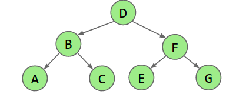
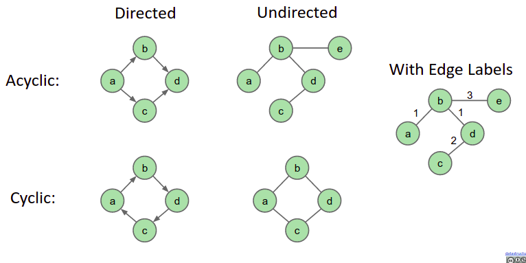

# Tree and Graph Traversals

## Tree Definition (Review)

Tree
* A set of nodes (or vertices).
* A set of edges that connect those nodes.
* There is exactly one path between any two nodes.

Rooted tree
* The tree has a designated root.
* Every node except the root has exactly one parent.
* A node can have 0 or more children.

## Trees Traversals

Tree traversal refers to the process of visiting each node in a tree data structure, exactly once. Traversals are classified by the order in which the nodes are visited.



### Level Order Traversal

Iterate the tree by levels, from left to right.
* First level: D
* Second level: B F
* Third leve: A C E G

```
D B F A C E G
```

### Depth-First traversal

#### Pre-order Traversal

* Visit root node.
* Visit all the nodes in the left subtree.
* Visit all the nodes in the right subtree.

```java
preOrder(BSTNode x) {
    if (x == null) return;
    print(x.key)
    preOrder(x.left)
    preOrder(x.right)
}
```

```
D B A C F E G
```

#### In-order Traversal

* Visit all the nodes in the left subtree.
* Visit the root node.
* Visit all the nodes in the right subtree.

```java
inOrder(BSTNode x) {
    if (x == null) return;    
    inOrder(x.left)
    print(x.key)
    inOrder(x.right)
}
```

```
A B C D E F G
```

#### Post-order Traversal

* Visit all the nodes in the left subtree.
* Visit all the nodes in the right subtree.
* Visit the root node.

```java
postOrder(BSTNode x) {
    if (x == null) return;    
    postOrder(x.left)
    postOrder(x.right)
    print(x.key)   
}
```

```
A C B E G F D
```

## Graphs Definition

### Graph
* A set of nodes (or vertices).
* A set of zero of more edges, each of which connects two nodes.
* All trees are also graphs, but not all graphs are trees.

### Simple Graphs and Multigraphs
* Only one edge between each of two nodes.
* No edge from a node to itself.
* The course will only focus on simple graphs.

### Undirected and Directed Graphs
* Undirected graphs contain bidirectional edges.
* Directed graphs contain directed edges.

### Acyclic and Cyclic Graphs
* Cyclic graphs contain at least one graph cycle.
* Acyclic graphs do not have graph cycles.

### More Definitions
* Verticies with an edge between are adjacent.
* Vertices or edges may have lables or weights.
* A sequence of vertices connectted by edges is a path.
* A path of which first and last verticies are the same is a cycle.
* Two vertices are connected when there is a path between them.
* If all vertices are connected, the graph is connected. 



## Graph Problems

### s-t Path

Find whether there's a path between vertices s and t.

To solve this problem, an algorithm similar to the tree traversal is created. 

```java
public boolean connected(s, t)

mark s

if (s == t):
    return true;

for child in unmarked_neighbors(s):
    if isconnected(child, t):
        return true;

return false;
```

The algorithm marks the verticies it has already visited to avoid infinite loop.

### DFS (Depth First Search)

This algorithm of exploring a neighbor’s entire subgraph before moving on to the next neighbor is known as Depth First Traversal.

This kind of traversal could help us to find a path from s to every other reachable vertex, visiting each vertex at most once.

To implement this traversal algorithm, two arrays, `marked` and `edgeTo`, are required to record whether an vertex is marked and the parent of the vertex. 

* Mark v.
* For each unmarked adjancent vertex w:
* * Set `edgeTo[w] = v`.
* * Run these steps for w.

### Graph Traversals

* DFS Preorder: Action is before DFS calls to neighbors. (The algorithm created above.)
* DFS Postorder: Action is after DFS calls to neighbors.
* BFS (Breadth First Search) Order: Act in order of distance from s. (Analogous to "level order.") 

