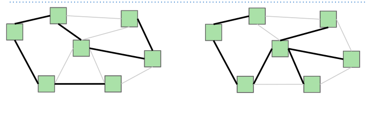
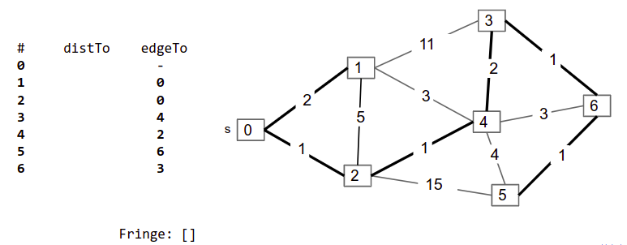
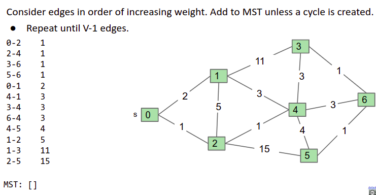
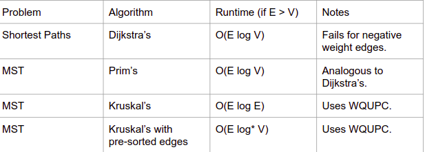

# Minimum Spanning Trees

## Definition

Given an undirected graph, a spanning tree T is a subgraph of G, which has the following properties.
* Is connected.
* Is acyclic.
* Includes all of the vertices.




A minimum spanning tree is a spanning tree of minimum total weight.
A shortest paths tree depends on the start vertex, while there is no source for a minimum spanning tree. 


## Cut Property

* A cut is an assignment of a graph’s nodes to two non-empty sets.
* A crossing edge is an edge which connects a node from one set to a node from the other set.
* Given any cut, minimum weight crossing edge is in the MST.


## Generic MST Finding Algorithm

* Start with no edges in the MST.
* Find a cut that has no crossing edges in the MST. 
* Add smallest crossing edge to the MST.
* Repeat until V-1 edges.

## Prim’s Algorithm

* Start from some arbitrary start node.
* Repeatedly add shortest edge that has one node inside the MST under construction.
* Repeat until V-1 edges. 
## Before
 

## After 


### Implementation

Prim’s and Dijkstra’s algorithms are similar, however:
* Dijkstra's considers "distance from the source".
* Prim's considers "distance from the tree."

```java
public class PrimMST {
    public PrimMST(EdgeWeightedGraph G) {
        edgeTo = new Edge[G.V()];
        distTo = new double[G.V()];
        marked = new boolean[G.V()];
        fringe = new SpecialPQ < Double > (G.V());

        distTo[s] = 0.0;
        setDistancesToInfinityExceptS(s);
        insertAllVertices(fringe);

        /* Get vertices in order of distance from tree. */
        while (!fringe.isEmpty()) {
            int v = fringe.delMin();
            scan(G, v);
        }
    }

    private void scan(EdgeWeightedGraph G, int v) {
        marked[v] = true;
        for (Edge e: G.adj(v)) {
            int w = e.other(v);
            if (marked[w]) {
                continue;
            }
            if (e.weight() < distTo[w]) {
                distTo[w] = e.weight();
                edgeTo[w] = e;
                pq.decreasePriority(w, distTo[w]);
            }
        }
    }
}
```

### Runtime

Priority Queue operation count, assuming binary heap based PQ.
* Insertion: V, each costing `O(log V)` time.
* Delete-min: V, each costing `O(log V)` time.
* Decrease priority: `O(E)`, each costing `O(log V)` time.

Overall runtime: `O(V * log(V) + V * log(V) + E * logV)`.
Assuming E > V, this is just `O(E log V)`.  


## Kruskal’s Algorithm

* Consider edges in increasing order of weight.
* Add edge to MST unless doing so creates a cycle.
* Repeat until V-1 edges. 


### Before 
 

### After 


### Implementation

Adding an edge to MST means that add the edge to the ArrayList and connect the two vertices in the `WeightedQuickUnion`. If the two vertices are already connected, the edge should be ingored since adding it will create a cycle.

```java
public class KruskalMST {
    private List < Edge > mst = new ArrayList < Edge > ();

    public KruskalMST(EdgeWeightedGraph G) {
        MinPQ < Edge > pq = new MinPQ < Edge > ();
        for (Edge e: G.edges()) {
            pq.insert(e);
        }
        WeightedQuickUnionPC uf =
            new WeightedQuickUnionPC(G.V());
        while (!pq.isEmpty() && mst.size() < G.V() - 1) {
            Edge e = pq.delMin();
            int v = e.from();
            int w = e.to();
            if (!uf.connected(v, w)) {
                uf.union(v, w);
                mst.add(e);
            }
        }
    }
}
```

### Runtime

* Insertion: E, each costing `O(log E)` time.
* Delete-min: `O(E)`, each costing `O(log E)` time.
* Union: `O(V)`, each costing `O(log V)` time.
* IsConnected: `O(E)`, each costing `O(log V)` time.
Overall runtime: `O(E + V log * V + E log * V)`.
Assuming E > V, this is just `O(E log V)`. 

 


### Running Time Analysis Comparison 

